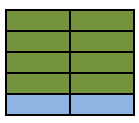
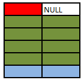
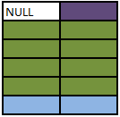
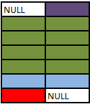

## Transactional Database

- used to process trasactions 
- both **read and write** optimised. 

### ACID semantics 
A set of SQL statements which are governed by the ACID  properties.
sample transaction => transaction of cash is withdrawn bank account to cash account

>[!NOTE] 
**Atomicity**\
 Each transaction is a single unit of action \
eg: 
amount should be reduced from bank account and added to the cash account . Either both of them is recorded or none is recorded. 

>[!NOTE]  
**Consistency** \
transactions should take data from one valid state to another. 

>[!NOTE] 
**Isolation** \
concurrent transactions cannot interfere with eachother. \
A application that reads bank balance cannot return information like this :\
*Bank Balance* => after transaction occurred.\
*Cash Balance* => before the transaction occurred. 

>[!NOTE]
**Durability**\
 when transaction is committed it will not change even if database system went offline.

## Analytical Databases

- ready heavy operations 
- store vast volumes of historical data 
- data is stored in data warehouses 

[more about analytical databases](https://learn.microsoft.com/en-us/training/modules/explore-core-data-concepts/6-analytical-processing)

## SQL joins 

sample table 

Note - here the colour of the row represent value of the coloumn which the table is matched on. 

### Inner Join
returns all the rows which are matching the join condition. 

note that only the *green and blue* cells are matched as they are ones which have same values . 

### Left Join 

reaturns all the rows of left table and corresponsding matching row in right table or null if there isnt a matching table . 

**Left Table** - Table on left side of the *JOIN*  command . 

note =>  that the *red cell* is returned will null as there isnt an corresponsding value on right table 

### Right join 

reaturns all the rows of right table and corresponsding matching row in left table or null if there isnt a matching table . 

**Right Table** - Table on tight side of the *JOIN*  command . 

note =>  that *purple cell* will return as null as corrosponding value becuase of the null. 

### Full Join 

returns all the rows of the right table and corresponding matching row and also all the rows of the left table. 

Note => here both *purple and red* cells are returned with null as they do not have a corresponding element.  

### Cross Join 
here the each row of the table A is joined with all the rows in the table B. 

### Self Referencing Join 
 here the same table is join on itself based on common criteria. 

