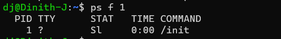

## Installing in Linux

### Installing Asp .NET core on Linux

> to install on ubuntu 18.04 LTS

use the below command set

```shell
wget -q https://packages.microsoft.com/config/ubuntu/16.04/packages-microsoft-prod.deb
sudo dpkg -i packages-microsoft-prod.deb
sudo add-apt-repository universe
sudo apt-get install apt-transport-https
sudo apt-get update
sudo apt-get install -y aspnetcore-runtime-3.1 ## for the version 3.1
```

to get the **runtime versions** repeat above steps with

```shell
dotnet --list-runtimes ## get the donet runtimes 
```

### Install azcopy tool in linux

follow the commands in the below [github Post](https://gist.github.com/aessing/76f1200c9f5b2b9671937b3b0ed5fd6f) .

### Install powershell in linux

follow the commands in [microsoft docs](https://docs.microsoft.com/en-us/powershell/scripting/install/install-ubuntu?view=powershell-7.2#installation-via-package-repository)

## Linux Process Management

the first process is the **Init** process , it is triggered by the linux kernel.


when new porcess is triggered it will **fork itself** and called process  *replace one of the init processes*.
pf

### view the current cpu and memory availability

``` top ``` can be used to view the ongoing processes, cpu usage and memory usage

### ps commands 

ps command values.

- a = show processes for all users
- u = display the process's user/owner
- x = also show processes not attached to a terminal


### process commands

- ``` & ``` - send a process to background

- ``` lsof -i TCP:<port> ``` - get the processes running on specific port

- ``` jobs ``` - get all the processes running in the background

- ``` fg < process id > ``` - get process to the foreground

- ``` kill < process id > ``` - sends the kill or shutdown signal to application

- ``` kill -9 < process id > ``` - kill a process from that id by the kernel

## Linux File managment

### Directory Manipulations

- ``` mkdir < directory name > ```  => create a directory

- ```mkdir -p dinith/dinith1/dinith2``` => create nested directories

### compress  and extract files

**tar** command can be used to compress and extract .gz files

- ```tar -czvf name-of-archive.tar.gz /path/to/directory-or-file``` - to compress to **.gz** file

- ``` tar -xzvf archive.tar.gz ``` - will extract contents in a compressed file

- ``` tar -xzvf archive.tar.gz -C /dinith/content ``` - w8ill extract contents to a specific folder

## Linux search content

content can be searched and replaced in a file by different commands.

### sed command

use to search psatterns in text files and replace them.

``` sed '/s/text1/text2/' <filename> ``` - retrun set of text after the pattern matching and replacement.

**sed commands arguments**

- *text1* - search for this value
- *text2* - replace with this value

``` sed -i '\s\text1\text2\' <filename> ``` - replaces the text matching the pattern on the source file

note that the forward slash (**/**) is know as the *delimeter*. Apart from ti other characters can be used - ( *. \ ,< space >*)

## Linux Output Redirection

linux  has 3 main streams of standered input / output

- The standard input (stdin) device is the keyboard. - 0
- The standard output (stdout) device is the screen. - 1
- The standard error (stderr) is for error messages. - 2

### the pipe command  ( | )

``` < command 1 > | < command 2 > ```

 the pipe command redirects **std output** of its **command 1** to **std input** of **command 2**.

``` |& ``` - redirects both the **std output** and the **std error** .

### the tee command

it redirect the outtput two different streams .
eg :
    ``` ls -l | tee world.txt ``` - sends the output of ls -l to the *console and world.txt* file.

### the > command

- ``` > ```  - writes the standered output to file 
- ```>>``` - appends the standered output to file

### the < command

## Linux useful commands

- ``` wget <url> ``` - download anything from web

 eg :- ``` wget "https://aka.ms/downloadazcopy-v10-linux" ``` will download the azcopy tool archive from the web .
