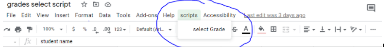

### Get google sheet 

get the **active sheet**

```javascript
var sheet = SpreadsheetApp.getActiveSpreadsheet() // get active spreadsheet  from spreadsheet app 
     .getActiveSheet(); // get the active sheet / page
```

get sheet by **sheet name**

```javascript
var sheet2 = SpreadsheetApp.getActiveSpreadsheet().getSheetByName("Sheet2"); // name of the sheet should be given
```

### getting a value 

Can get the values by a  passing cell range as a string . The values will be **returned as an array**

```javascript
var limitValues = sheet.getRange("F5:F10").getValues(); 
```

### setting a value in cell range 
provided value will be applied to the cell range 

```javascript
sheet.getRange(2, 2, 3,3) // get the range of cells 
// p1 - starting row, p2 - starting column, p3 - no of rowa , p4 - no of coloumns , 
    .setValue("dj"); // setting the value in that particular range
```

## Sheet ui changes 

### adding a element to UI

Added the Select Grade  element to the UI



code to add 

```javascript
// create a menu named scripts 
SpreadsheetApp.getUi().createMenu("scripts") 
    // param 1 => display text 
    // param 2 => method to invoke
    .addItem("select Grade", "selectGrade") 
    .addToUi();
```


