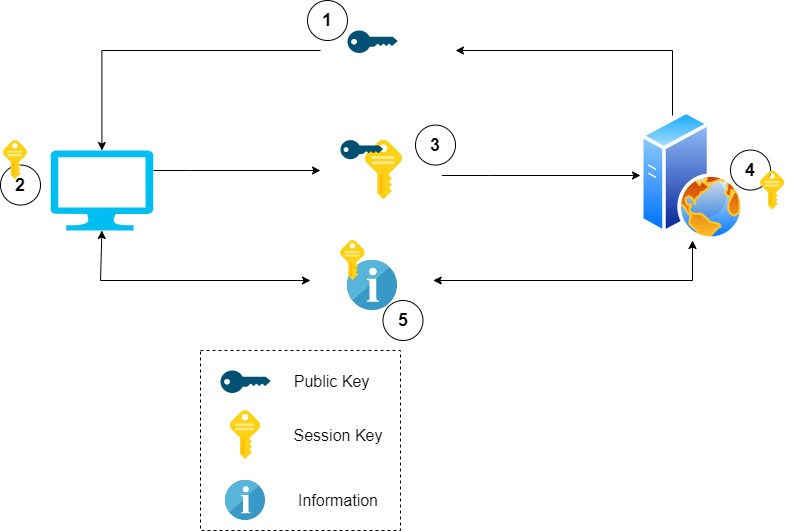

## SSL handshake 

The SSL handshake happens between the browser and the server . It uses the both the Assymetric Encryption and Symetric Encription. 

### Handshake Steps 

>> 1 - server sends public key ot the clients computer 

>> 2 - client computer generate the session key 

>> 3 - session key is encrypted with public key and sent to the server

>> 4 - server decrypts the message with its private key and get the session key.

>> 5 - client computer and the server can communicate freely encrypting sata with session key . 

